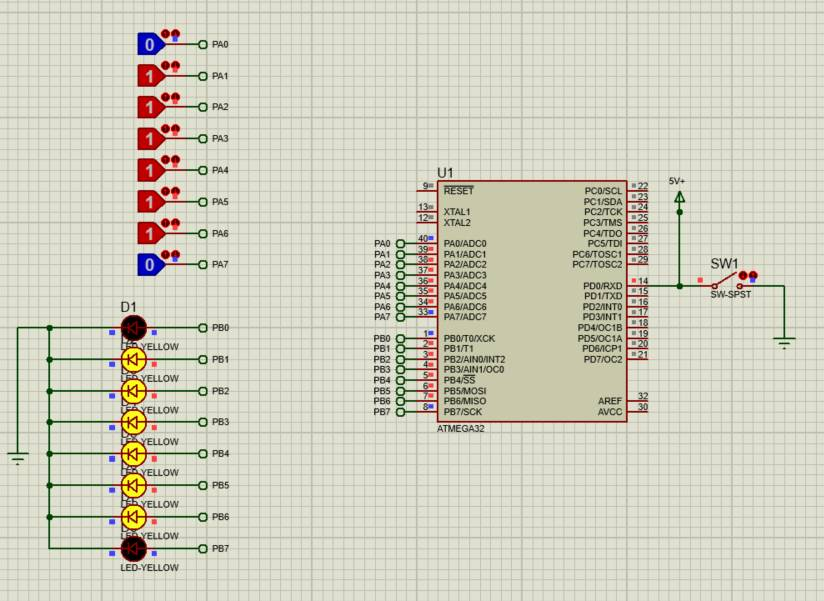
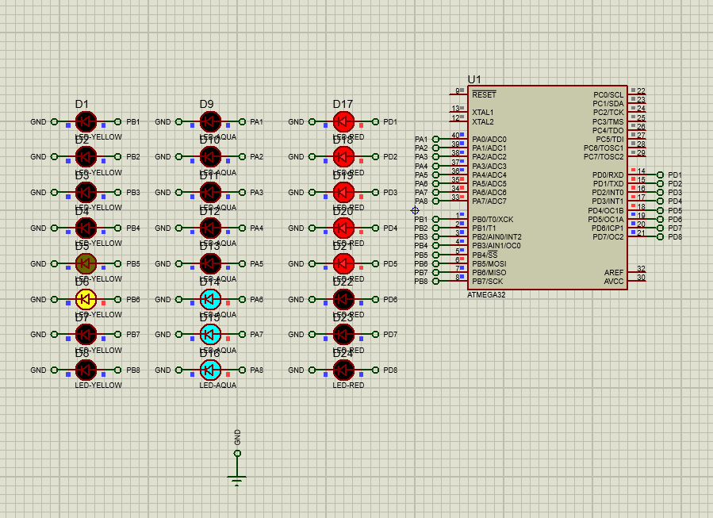

## 🧪 Practice Projects

These two mini projects were built **just for practice and experimentation** while learning AVR programming with **CodeVisionAVR**. 🚀  
The goal wasn't to create complete applications, but to gain a better understanding of different microcontroller concepts through hands-on coding.

### 💾 Project 1 — EEPROM Read & Write

A simple project that demonstrates how to work with the AVR's internal **EEPROM**.

✨ Features:
- 📥 Reads an 8-bit value from **PORTA**
- 💾 Stores the value in EEPROM when the push button is pressed
- 📤 Continuously displays the saved value on **PORTB**
- 🎯 Great for practicing EEPROM operations and digital input handling

#### 📸 Preview

  

---

### 💡 Project 2 — LED Pattern Generator

A fun project that creates different LED animations on **PORTA**, **PORTB**, and **PORTD** using bitwise operations.

✨ Features:
- 🔄 Multiple LED shifting patterns running simultaneously
- ⚡ Uses bitwise left-shift operations
- 🧠 Helps understand port manipulation and binary logic
- ⏱️ Simple timing control using software delays

#### 📸 Preview

  

---

> 💙 **Note:** These projects are simple learning exercises created purely for testing and improving my embedded programming skills. Every small experiment helps me understand the hardware a little better!
